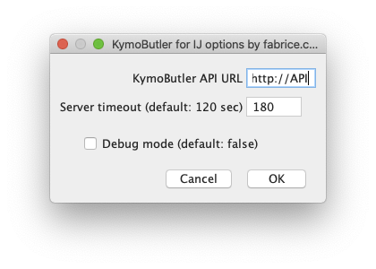
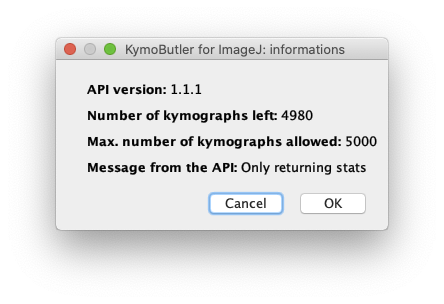
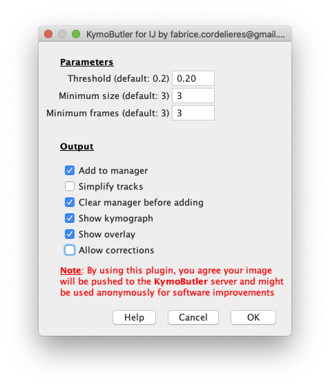
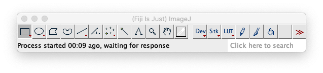
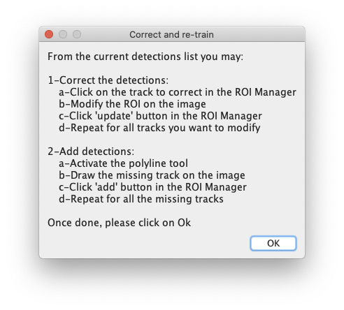
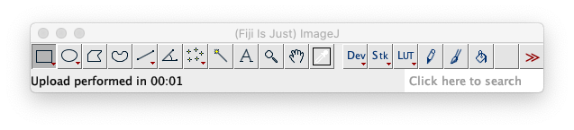
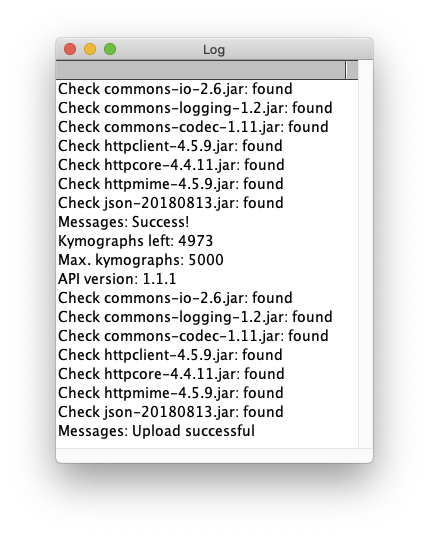

# KymoButler for ImageJ

## Before we start
This plugin doesn't do any processing per-se: its aim is to provide an easy to use interface between ImageJ/Fiji and the [KymoButler](https://deepmirror.ai/software/kymobutler/) portal. It allows pushing from ImageJ/Fiji towards the KymoButler servers the kymographs that were obtained using a dedicated tool (please consider having a look at [KymoToolBox](https://github.com/fabricecordelieres/IJ-Plugin_KymoToolBox)).

Please note that your data will be sent to the KymoButler servers and might be used to improve the algorithms . Although the data is anonymized, this point is worth noticing !

No commercial interest here, but the API that comes with this software is limited by default to restrict image size, computation time, and batch processing. Contact [deepMirror](https://deepmirror.ai), the company that runs the API, for access to an unrestricted API (charges apply).

## Installing the plugin
This plugin heavily relies on external libraries, that should be installed alongside the plugin:

* commons-io, v2.6
* org.apache.httpcomponents/httpclient, v4.5.9
* org.json/json, v20180813

### Installing the plugin, the hard way:

* Get the plugin from [here](https://github.com/fabricecordelieres/IJ-Plugin_KymoButler_for_ImageJ/releases/download/v1.0.0/KymoButler4IJ_.jar) and place it in your plugins folder
* __commons-io, v2.6:__ follow this [link](https://www-eu.apache.org/dist//commons/io/binaries/commons-io-2.6-bin.zip), download the zip file, extract it, and place the _commons-io-2.6.jar_ file in your plugins folder.
* __org.apache.httpcomponents/httpclient, v4.5.9:__ follow this [link](https://www-eu.apache.org/dist/httpcomponents/httpclient/binary/httpcomponents-client-4.5.9-bin.zip), download the zip file, extract it, and place the _commons-codec-1.11.jar_, _commons-logging-1.2.jar_, _httpclient-4.5.9.jar_, _httpcore-4.4.11.jar_ and _httpmime-4.5.9.jar_ files in your plugins folder.
* __org.json/json, v20180813:__ follow this [link](https://github.com/stleary/JSON-java/archive/20180813.zip) download the zip file, extract it, compile it the place the __json-20180813.jar__ file in your plugins folder.

### Installing the plugin, the easy way:
Get everything from [here](https://github.com/fabricecordelieres/IJ-Plugin_KymoButler_for_ImageJ/releases/download/v1.0.0/KymoButler4IJ-and-friends_v1.zip), unzip the file, don't worry about its content, and paste all its content into your plugins folder.

## Setting-up the plugin

Parameters:

* _KymoButler API URL:_ The URL provided by [KymoButler](https://deepmirror.ai/software/kymobutler/). The default API restricts image size, computation time, and batch processing.
* _Use default API ? (Limited but free)_: This will use a fully free API that has some limitations in terms of batch processing, pixel number, and CPU time.
* _Server timeout:_ The maximum time the plugin will wait for a response from the server before cancelling the process.
* _Debug mode:_ Allows debugging possible communication issues with the server (see the [Debug options and tools](#debug-options-and-tools) section).

## Getting information

As [KymoButler](https://deepmirror.ai/software/kymobutler/) has a certain allowance set, you may want to check how many analysis were done/remain to be used. This is the function of the __Plugins/KymoButler for ImageJ/KymoButler Infos__ that will return all the information into a single window once called. Please allow some time for the request to be pushed and the data to be pulled (around 4 sec):

## Performing an analysis

* Before performing an analysis, the kymograph should be opened. The path along which the object moves should be set as the x axis and time along the y axis.
* From the plugins menu, select the following entry: __KymoButler for ImageJ/KymoButler Analyze__. A graphical user interface should appear:

* Fill in the differents parameters/check the appropriate options:
	* _Threshold (default: 0.2):_ threshold for track detection (a probability of the detection to be a track).
	* _Minimum size (default: 3):_ minimum size of detected objects.
	* _Minimum frames (default: 3):_ minimum number of consecutive frames per track.
	* _Add to manager:_ once returned, the tracks will be added as individual regions of interest to the ROI Manager.
	* _Simplify tracks:_ returned tracks are coded as one coordinate per time point. For linear movements along the path, the tracks might be re-encoded as segments when the speed is constant.
	* _Clear manager before adding:_empties the ROI Manager before pushing the new results.
	* _Show kymograph:_together with all the analysis results, KymoButler returns a copy of the original kymograph. This checkbox allows checking that the input data was indeed well interpreted by KymoButler by allowing to display what it has seen.
	* _Show overlay:_ diplays an RGB image where the detected tracks are overlayed onto the original image. Each track is encoded with a different color and the result is presented as a composite image, made of 3 channels (red, green, blue).
	* _Allow corrections:_ when activated, this options pops-up a "wait for user" window. The user is invited to modify any mis-placed (select the relevent ROI, modify it, then use the 'update' button from the ROI Manager) or missing detection (draw the ROI, then add it to the ROI Manager using the 'add' button). Once Oked, the image and the content of the ROI Manager are pushed towards the kymoButler server to be added to the training set (see the [Correcting and re-training KymoButler](#correcting-and-re-training-KymoButler) section).

* While the plugin is waiting for the analysis to be performed, the status bar should read as follows:

* Once analysis response has been received, the status bar should read as follows:

* In case the _Allow corrections_ box has been ticked, the following dialog box will pop-up:

* Follow the instructions, make all modifications, __THEN ONLY__ click on Ok. Once data have been uploaded, the status bar should read as follows:

 

## Correcting and re-training KymoButler

In a addition to the after-analysis re-training, this step can be performed independently. It requieres a kymograph to be opened and the tracks to be loaded in the ROI Manager. Once both conditions are filled, simply launch the __KymoButler for ImageJ/KymoButler Upload__ plugin.

## Debug options and tools

When the debug mode is activated, any plugin's launch will generate an output to the log window of the libraries' check. Once the process has been completed additionnal informations will be logged like messages from the API (message and version of the API) and details about the allowance (kymographs left/total number of allowed analysis):

In addition, when the debug mode is activated, any communication from the server is automatically saved at the root of ImageJ/Fiji installation folder ans a JSON file. The file is named after the date and time it has been issued (ex: 2019-11-18\_12-40-28\_debug\_KymoButler.json). 

For convenience, a plugin is provided that is able to decode the JSON file into image, tracks and messages: __KymoButler for ImageJ/KymoButler JSON Parser__.

## KymoButler\_for\_ImageJ and ImageJ/Fiji macros ?

All the elements from this collection of plugins are macro-recordable !
